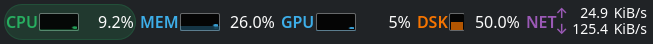

# KStats

KStats is a KDE Plasma 6 panel widget inspired by exelban/stats. The first
version focuses on a menu-bar style status strip with a click-to-open dropdown,
using CPU, memory, GPU, disk, and network readings from KDE's KSysGuard sensor API.

## Screenshots



<table>
  <tr>
    <td align="center"><strong>CPU</strong></td>
    <td align="center"><strong>Disk</strong></td>
    <td align="center"><strong>Network</strong></td>
    <td align="center"><strong>Memory</strong></td>
    <td align="center"><strong>GPU</strong></td>
  </tr>
  <tr>
    <td width="20%"></td>
    <td width="20%"></td>
    <td width="20%"></td>
    <td width="20%"></td>
    <td width="20%"></td>
  </tr>
</table>

## Install for the current user

```sh
kpackagetool6 --type Plasma/Applet --install .
```

After installing, add `KStats` from Plasma's widget picker.

For local testing without installing:

```sh
plasmoidviewer --applet .
```

For KDE store:
https://www.opendesktop.org/p/2364289/

## GPU monitoring

Enable `GPU: Show in bar` in the widget settings and choose a `Panel GPU`.
The panel shows utilization and a sparkline. Click it to open usage, memory,
and temperature readings for the detected GPUs. GPU display is off by default.

Unavailable readings show `N/A` without changing the panel width. Monitoring
retries automatically and keeps the selected GPU. KDE device IDs (`gpu0`,
`gpu1`, etc.) may change after hardware changes; check the selection afterward.

Readings depend on KDE's KSystemStats service and the installed driver:

- AMD: utilization and VRAM use the `amdgpu` driver; temperature depends on
  available hardware sensors
- Nvidia: requires a working `nvidia-smi` installation; Nouveau is not supported
  by KDE's Nvidia backend
- Intel: `i915` utilization requires KSystemStats 6.4 or later and the distro's
  `ksystemstats_intel_helper` with `CAP_PERFMON`; separate `xe` support is
  targeted for Plasma 6.8 and depends on distro build support

Check the same sensors in Plasma System Monitor when troubleshooting. KDE can
report zero for unsupported metrics, and integrated GPU memory may not include
all shared system memory available to the GPU.

See [KDE's GPU backend](https://invent.kde.org/plasma/ksystemstats/-/tree/master/plugins/gpu),
[Intel helper packaging](https://community.kde.org/Distributions/Packaging_Recommendations#Ksystemstats_package_configuration),
and the [Intel Xe announcement](https://blogs.kde.org/2026/05/23/this-week-in-plasma-xe-driver-support-and-polishing-discover/).

## Scope

Implemented:

- compact panel representation
- Stats-like expanded dropdown with CPU, GPU, NET, and DISK tabs
- CPU, memory, disk, network sensors, plus optional GPU utilization in the panel
- CPU model plus auto-discovered CPU temperature and fan sensors
- configurable sensor IDs and update interval
- auto-discovered GPU usage, memory, and temperature sensors

Not implemented yet:

- voltage and power sensors

Those require hardware-specific Linux backends or deeper integration with KDE's
sensor browser and should be added after the basic widget is stable.
